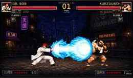
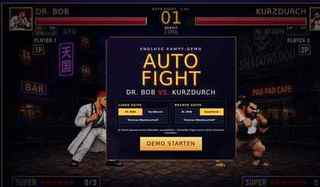
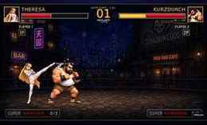
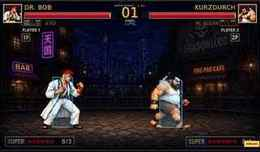

# AUTO FIGHT — Dr. BOB vs. KurzDurch vs. Theresa MachsLochuff

Eine 2D-Kampfdemo ohne Build-System, Server oder externe Abhängigkeiten.
`index.html` im Browser öffnen und es läuft. Sprites und Hintergrund liegen optimiert im
Ordner `assets/`; die Demo bleibt vollständig lokal und offline nutzbar.

Zwei Kämpfer treten gegeneinander an, gesteuert von einem Regie-Algorithmus ("Director"),
der Angriffe, Kombos, Blocks, Konter und Spezialattacken plant.



---

## Schnellstart

```bash
# einfach öffnen
xdg-open index.html      # Linux
open index.html          # macOS
start index.html         # Windows
```

Im Startmenü links und rechts je einen Kämpfer wählen → **Demo starten**.
Der Kampf läuft von allein weiter, bis einer k. o. geht.

| Bedienung | Wirkung |
|---|---|
| Karten im Startmenü | Kämpfer für linke / rechte Seite wählen |
| **Demo starten** | Kampf beginnt |
| **Neuer Kampf** | nächste Runde mit derselben Paarung |
| **Hitboxen** (unten rechts) | Trefferzonen einblenden |



---

## Die Kämpfer

| Kämpfer | Statur | Spezial | Kombos |
|---|---|---|---|
| **Dr. BOB** | groß, weiter Kittel | `kame` — **Kamehameha**, Energiestrahl quer über den Bildschirm | DOC RUSH, REDLINE |
| **KurzDurch** | schwer, kurze Reichweite | `comet` — **Komet**, Einschlag von oben | BRAID BLITZ, GROUND BREAK |
| **Theresa MachsLochuff** | leicht, schnell | `choke` — **NECK LOCK**, Sprung an den Hals mit Beinschere | WHITE FANG, AIR STING |



---

## Wie die Sprites aufgebaut sind

Jede Figur hat ein **5×5-Blatt = 25 Einzelbilder**, das die Engine nach Zeile liest:

| Zeile | Inhalt |
|---|---|
| 0 | Kampfstellung (Leerlauf) |
| 1 | Laufen |
| 2 | Schlag |
| 3 | Tritt / Sprungtritt |
| 4 | Treffer, Sturz, k. o., Aufstehen |

Dr. BOB hat zusätzlich ein **zweites Blatt nur für den Kamehameha** (25 Bilder:
Aufladen → Abschuss → Strahlsegmente → Einschlag → Nachhall).

### Zwei Regeln, an denen die ganze Darstellung hängt

**1. Gemeinsame Bodenlinie.** Jedes Einzelbild wird beim Aufbereiten so in seine
460-px-Zelle gesetzt, dass die Unterkante der Figur immer auf derselben Höhe liegt.
Dadurch stehen alle drei Kämpfer exakt auf dem Boden der Arena, ohne pro Figur
nachjustieren zu müssen.

**2. Fuß-Verankerung.** Jedes Bild wird waagerecht am **Mittelpunkt der Füße**
(unterste 18 % der Silhouette) ausgerichtet, nicht an der Bildmitte. Ohne das wandert
die gezeichnete Figur von Pose zu Pose hin und her, während Hurt- und Hitbox an der
Spielposition kleben — die Boxen scheinen dann zu „springen". Mit Fuß-Verankerung
sitzen sie fest an der Figur.



Pro Figur hält die Engine dazu drei Werte:

| Wert | Bedeutung |
|---|---|
| `displayH` | Körperhöhe auf dem Bildschirm in Pixeln — Bezugsgröße für alle Trefferzonen |
| `spriteZoom` | Anteil der Figur an der 460-px-Zelle; daraus ergibt sich die Zeichengröße |
| `baseline` | Abstand der Bodenlinie zur Zellunterkante |
| `hurtW` | Breite der Trefferzone als Anteil von `displayH` |

---

## Wie die Engine arbeitet

**`P`** — Posen-Tabelle mit Gelenkpunkten (Becken, Wirbelsäule, Hände, Füße, Kopf).
Sie steuert Timing und Trefferzonen; gezeichnet wird das passende Sprite.

**`MOVES`** — jede Aktion als Liste von `[Pose, Dauer in ms, Phasenname]`.
Der Phasenname („Ausholen", „Treffer", „Erholung") entscheidet, wann eine Attacke
scharf ist und ob ein Gegentreffer als **COUNTER** zählt.

**`ATTACKS`** — Schaden, Reichweite, Rückstoß und die Trefferreaktion pro Angriffsart.

**`director(dt)`** — die Regie. Sie würfelt Angriffe, hält Abstand, plant Finten
(`feint` → `approach` → `attack`), lässt Kombos laufen und setzt Konter an.
Etwa jeder dritte Schlagabtausch ist eine Kette, ein kleinerer Teil endet mit einer
Spezialattacke; unter 35 Lebenspunkten steigt deren Wahrscheinlichkeit.

**Trefferprüfung** — `getHurtbox()` liefert die Trefferzone (fest an der Figur),
`activeHitbox()` die aktive Angriffszone der laufenden Aktion. Überschneiden sie sich,
läuft `dealHit()`: Block, Counter, Schaden, Rückstoß, Bildschirmruckeln, Trefferstopp,
Funken und Kombozähler.

**FX-Engine** — Pixelfunken, Staub, Ringe, Speedlines und Trefferzahlen als eigenes
Partikelsystem über dem Canvas.

---

## Konsolen-Hooks zum Testen

In der Browser-Konsole (F12):

```js
__forceSpecial('left')    // Spezial der linken Seite sofort auslösen
__forceSpecial('right')   // dasselbe für rechts
__probeFight()            // aktueller Zustand beider Kämpfer (Aktion, Phase, Zeit, x)
```

---

## Darstellung auf dem Handy

Im Hochformat wird die Arena vollständig eingepasst (`object-fit: contain`) und das
HUD verkleinert, damit es die kleine Spielfläche nicht zudeckt. Im Querformat und am
Desktop läuft die Arena auf voller Breite. Die 16:9-Zeichenfläche selbst ist immer
1536 × 864 — skaliert wird nur die Anzeige, nie die Spiellogik.

---

## Hinweis zu den Grafiken

Die Figuren-Sprites sind eigene, KI-erzeugte Kataloge. Der **Arena-Hintergrund** stammt
dagegen aus fremdem Material und zeigt Marken- und Figurenelemente Dritter. Das Repo ist
deshalb als **privates Repository** gedacht — für eine Veröffentlichung müsste der
Hintergrund vorher gegen eigenes Material getauscht werden.

Siehe [CHANGELOG.md](CHANGELOG.md) für die Entwicklungsschritte.
